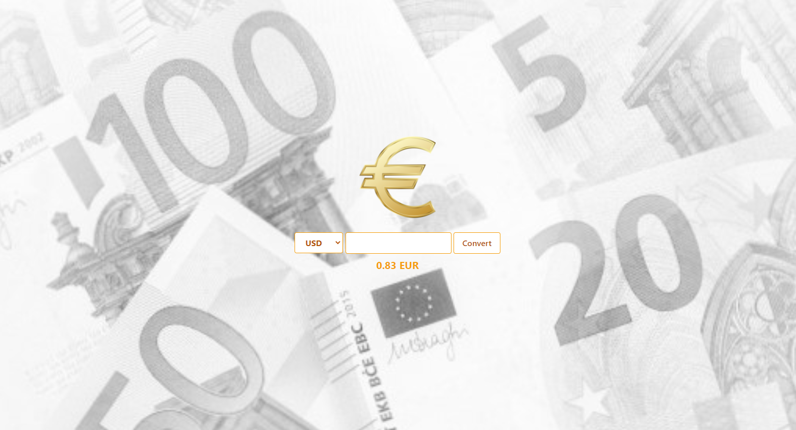

## About CurrencyConverter

Small app for converting other currencies to EUR.
Data is found at https://www.bank.lv/vk/ecb.xml and can be imported or updated with custom artisan command import:currency. 

Looks like this:

---
This app was created with:

